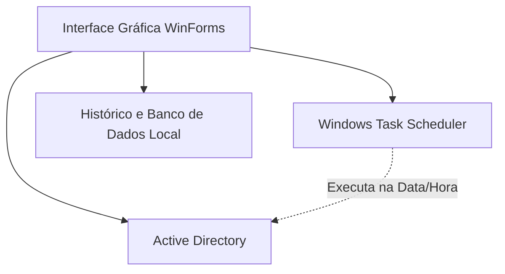

# AD User Manager - Agendador de Férias AD

[⬇️ **BAIXAR O EXECUTÁVEL PRONTO (ADUserManager.exe)**](Download/ADUserManager.exe)

## Visão Geral
Programa em **VB.NET (Windows Forms)** que permite desabilitar usuários do [Active Directory](https://learn.microsoft.com/en-us/windows-server/identity/ad-ds/get-started/virtual-dc/active-directory-domain-services-overview) e agendar automaticamente a reativação em uma data/hora futura, usando [PowerShell](https://learn.microsoft.com/en-us/powershell/) e **Tarefas Agendadas do Windows**.

## Arquitetura
A ferramenta utiliza uma interface rica que se comunica com o sistema operacional para realizar operações automáticas.



## Estrutura de Arquivos

| Arquivo | Descrição |
|---------|-----------|
| `ADUserManager.vbproj` | Projeto .NET 8 WinForms |
| `app.manifest` | Manifesto para elevação de privilégios de Administrador (UAC) |
| `Program.vb` | Ponto de entrada da aplicação (Entry Point) |
| `MainForm.vb` | Formulário principal contendo toda a lógica visual e operações PowerShell |

## Funcionalidades

### 1. Desabilitar e Agendar Reativação
*   Insira o `sAMAccountName` do usuário e a data/hora de reativação desejada.
*   O programa executa `Disable-ADAccount` via PowerShell imediatamente.
*   Registra uma **Tarefa Agendada do Windows** para executar o comando de reativação na data/hora especificada.
*   A tarefa roda como `SYSTEM` com privilégios elevados, operando mesmo com o programa fechado.

### 2. Reativar Agora
*   Selecione uma tarefa na tabela e clique em **Reativar Agora**.
*   Executa `Enable-ADAccount` imediatamente.
*   Remove a tarefa agendada correspondente no Windows.

### 3. Remover Agendamento
*   Cancela a tarefa agendada sem reativar o usuário.
*   O usuário permanece desabilitado (requerendo ação manual futura).

### 4. Histórico Persistente
*   Todas as operações são salvas localmente em `%LocalAppData%\ADUserManager\history.json`.

## Detalhes do Agendamento (Por Baixo dos Panos)
Para as equipes de infraestrutura e administração de sistemas, é essencial compreender o fluxo exato de como a reativação é agendada para fins de auditoria e segurança:

1. **Local de Armazenamento**: Ao criar um agendamento, a ferramenta gera dinamicamente um arquivo de script PowerShell (`.ps1`) em uma pasta segura dentro do perfil do usuário que está rodando o programa:
   `%LocalAppData%\ADUserManager\scripts\` *(ex: C:\Users\nome\AppData\Local\ADUserManager\scripts\)*
2. **Conteúdo do Script**: O script contém as diretivas para reativar o usuário (`Enable-ADAccount -Identity 'Usuario'`) e, logo em seguida, um comando para **auto-descadastrar** a tarefa do Windows e deletar o próprio arquivo, garantindo que não fiquem resíduos no servidor.
3. **Execução no Task Scheduler**: A tarefa é registrada na raiz do Agendador de Tarefas do Windows. Ela é instruída a invocar o executável nativo `powershell.exe` em *background* passando como argumento a flag `-ExecutionPolicy Bypass` e apontando para o script local.
4. **Privilégios (SYSTEM)**: As tarefas são injetadas para rodar com privilégios máximos (`RunLevel Highest`) e utilizando a conta `SYSTEM` (LogonType ServiceAccount), garantindo que a reativação ocorra no servidor mesmo que o administrador original não esteja logado no dia/hora programados.

## Comandos PowerShell Utilizados

```powershell
# Verificar se o usuário existe
Get-ADUser -Identity '<username>'

# Desabilitar usuário
Disable-ADAccount -Identity '<username>'

# Reativar usuário
Enable-ADAccount -Identity '<username>'

# Criar tarefa agendada
$action = New-ScheduledTaskAction -Execute 'powershell.exe' -Argument '...'
$trigger = New-ScheduledTaskTrigger -Once -At '<datetime>'
Register-ScheduledTask -TaskName '<name>' -Action $action -Trigger $trigger ...

# Remover tarefa agendada
Unregister-ScheduledTask -TaskName '<name>' -Confirm:$false
```

## Como Compilar o .exe

### Pré-requisitos
*   [.NET 8 SDK instalado](https://dotnet.microsoft.com/download/dotnet/8.0)

### Compilação
Abra o terminal na pasta do projeto (`ADUserManager`) e execute o script `build.bat` ou rode diretamente:

```bash
dotnet publish -c Release -r win-x64 --self-contained true -p:PublishSingleFile=true -p:IncludeNativeLibrariesForSelfExtract=true -p:EnableCompressionInSingleFile=true
```

O arquivo `.exe` será gerado em:
`bin\Release\net8.0-windows\win-x64\publish\ADUserManager.exe`

> [!IMPORTANT]
> O `.exe` gerado é **self-contained** — não requer .NET instalado na máquina destino.

## Requisitos para Execução

| Requisito | Descrição |
|-----------|-----------|
| **Sistema Operacional** | [Windows 10/11](https://www.microsoft.com/windows/) ou [Windows Server 2016+](https://www.microsoft.com/windows-server) |
| **RSAT** | [Remote Server Administration Tools](https://learn.microsoft.com/en-us/troubleshoot/windows-server/system-management-components/remote-server-administration-tools) (Módulo ActiveDirectory do PowerShell) |
| **Privilégios** | Executar como **Administrador** (o manifesto solicita UAC automaticamente) |
| **Permissões AD** | Conta de usuário em execução com permissão para desabilitar/habilitar contas no AD |

## Design da Interface
*   Tema escuro baseado na paleta *Catppuccin Mocha*.
*   Seção de entrada com campo de usuário e seletores de data/hora intuitivos.
*   Botões de ação responsivos com *hover effects*.
*   Tabela de tarefas com identificação por status coloridos (Agendado = Amarelo, Reativado = Verde, Cancelado = Vermelho).
*   Log de atividades na tela com marcações de hora (timestamps) e coloração dinâmica por tipo de mensagem.
*   Barra de status lateral com indicador visual interativo.
