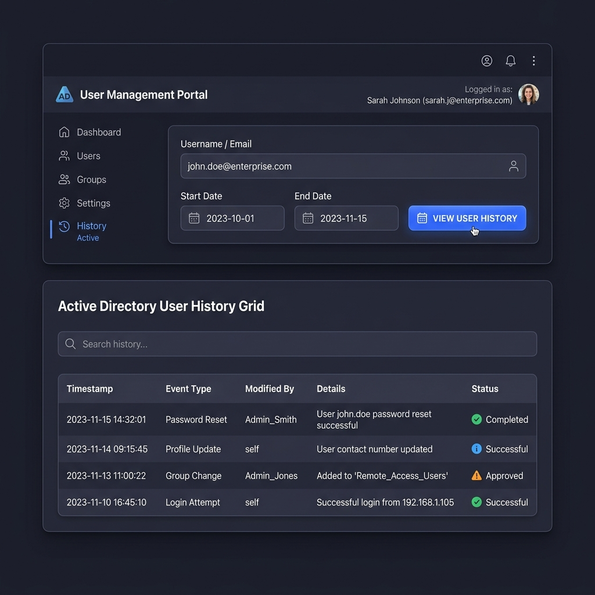
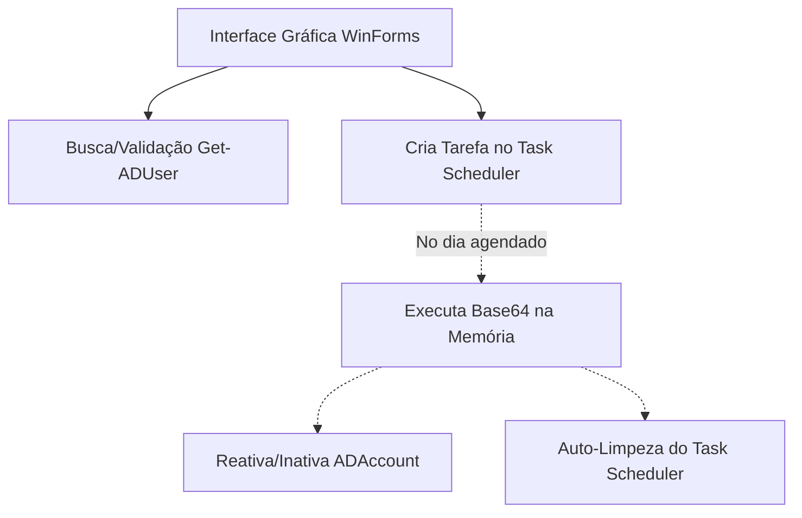

# AD User Manager - Agendador de Férias AD 🚀

<div align="center">
  
  <br><br>
  <strong>Uma ferramenta Enterprise em VB.NET para gerenciamento automatizado de férias no Active Directory.</strong>
</div>

---

### [⬇️ **BAIXAR O EXECUTÁVEL PRONTO (ADUserManager.exe)**](Download/ADUserManager.exe)

## Visão Geral
Programa focado em infraestrutura que permite desabilitar usuários do **Active Directory** instantaneamente e **agendar automaticamente a reativação** em uma data/hora futura, utilizando uma arquitetura robusta e invisível (*Zero-Scripts*) junto ao **Windows Task Scheduler**.

---

## 🌟 O que há de novo na Versão Corporativa?

### 1. Dashboard Enterprise (UI/UX)
O visual "quadrado" do Windows antigo ficou para trás. A nova interface foi desenhada seguindo padrões de design corporativos modernos:
*   **Borderless & Title Bar Customizada:** Sem bordas do sistema, design contínuo.
*   **Layout em Cartões (Cards):** Áreas de interação, busca e relatórios separadas em "Ilhas" visuais (Dark Mode com paleta *Catppuccin*).
*   **Ação Guiada (Call to Action):** O botão principal rouba a atenção visual, acelerando o trabalho do analista.

### 2. Validação Prévia (Anti-Erro)
Antes de agendar qualquer rotina no servidor, a ferramenta realiza um `Get-ADUser` silencioso para **validar se o usuário realmente existe**. Caso haja algum erro de digitação no nome, o sistema bloqueia o agendamento preventivamente.

### 3. Barra de Busca Instantânea
Para ambientes com dezenas de colaboradores em férias, a nova **barra de busca** permite filtrar a tabela de histórico instantaneamente, encontrando o agendamento de um funcionário específico em milissegundos.

---

## 🔒 Arquitetura de Segurança (Zero-Scripts)
Para equipes de Segurança da Informação (InfoSec) e SysAdmins, a ferramenta foi projetada para não deixar vulnerabilidades no servidor:

1. **Sem Arquivos Ps1:** Nenhum arquivo de script (`.ps1`) é gravado no disco rígido do servidor. A ferramenta converte o comando PowerShell nativo em **Base64** diretamente no código compilado.
2. **EncodedCommand:** A tarefa injeta a string codificada via argumento `-EncodedCommand` no `powershell.exe`. Isso burla políticas de execução locais restritivas e previne falsos-positivos de antivírus.
3. **Auto-Limpeza Imediata:** A injeção contém a diretiva de reativação e, *na mesma linha*, a instrução `Unregister-ScheduledTask`. A tarefa **apaga a si mesma** do servidor no exato milissegundo em que é concluída.
4. **Privilégios Inabaláveis:** As tarefas rodam via usuário `SYSTEM` com privilégio máximo (`RunLevel Highest`). O servidor só precisa estar ligado para que a reativação ocorra; o Administrador não precisa estar logado!



---

## 🛠️ Como Utilizar

### 1. Desabilitar e Agendar Reativação
*   Insira o `sAMAccountName` (login) do usuário e a data/hora de retorno das férias.
*   O programa validará o usuário, executará `Disable-ADAccount` e agendará a reativação.
*   Acompanhe o log na tela verde!

### 2. Reativação Imediata (Emergência)
*   O funcionário voltou mais cedo das férias? Selecione-o na Tabela de Histórico e clique em **Reativar Agora ⚡**. O agendamento futuro é quebrado e ele volta a trabalhar na hora.

### 3. Remoção de Agendamento
*   Desistiu do processo? Clique em **Remover Agendamento 🗑️** para apagar a tarefa invisível do Windows Task Scheduler.

---

## ⚙️ Como Compilar Diretamente do Código Fonte

### Pré-requisitos
*   [.NET 8 SDK instalado](https://dotnet.microsoft.com/download/dotnet/8.0)

### Processo
1. Abra o terminal na pasta do projeto (`ADUserManager`).
2. Execute o script `build.bat` ou o comando direto:

```bash
dotnet publish -c Release -r win-x64 --self-contained false -p:PublishSingleFile=true
```

O arquivo final ficará na pasta interna `bin/Release/net8.0-windows/win-x64/publish/ADUserManager.exe`.

---

## 📋 Requisitos para Uso em Produção

| Requisito | Descrição |
|-----------|-----------|
| **Servidor** | [Windows Server 2016+](https://www.microsoft.com/windows-server) (Recomendado) ou Windows 10/11 |
| **Módulo AD** | Ferramenta RSAT instalada (*Remote Server Administration Tools*) |
| **Execução** | Rodar como **Administrador** (a janela pedirá permissão sozinha) |
